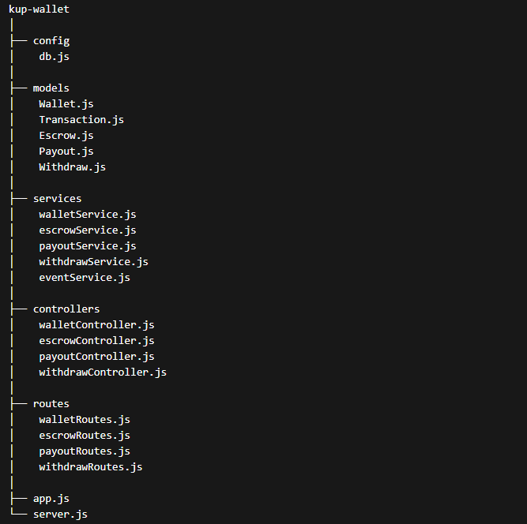

The Krishi Unnati Platform Wallet is a replica of RazorpayX which is RBI regulated Custodial Settlement Wallet System used for central funds holding and management.

----

## Project Folder Structure ## 

----

- All Services related to Payout Module is out-off scope or Post-Escrow Settlement functionality.

- It includes:

    1. models/Payout.model.js
    2. controllers/Payout.controller.js
    3. services/Payout.service.js
    4. routes/Payout.route.js

- Above these are Post-Escrow features. (Stastus: Yet to Implement)